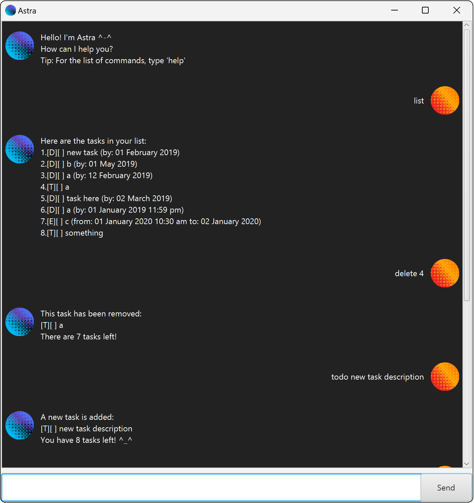

# Astra User Guide

Need a way to track all your tasks? Then Astra is for **you**!  
Astra is friendly chatbot that helps you with manage your task list.  

## Features
For all features commands below, parameters in **[square brackets]** are mandatory
and those in **(round brackets)** are optional.

### Adding tasks
There are 3 types of tasks.
* `todo [task description]`: creates a to do task with the description.
* `deadline [task description] /by [YYYY-MM-DD] (hour:minutes)`: 
creates a deadline task with the description and the specified deadline.
* `event [task description] /from [YYYY-MM-DD] [hour:minutes] /to [YYYY-MM-DD] [hour:minutes]`:
creates an event task with the description and duration.

### Managing tasks
* `mark [task number]`: mark the specified task as complete.
* `unmark [task number]`: mark the specified task as incomplete.
* `delete [task number]`: delete the specified task.
* `update [task number] /[task detail] [new update]`: updates the specified task with the new detail.
  * The available task details are:
    * `desc` - for all type of tasks
    * `by` - for deadline tasks
    * `from` - for event tasks
    * `to` - for event tasks

### Listing tasks
* `list`: list all the tasks.
* `find [search string]`: displays all tasks which description matches `[search string]`.

### Closing the application
* `bye`: Another way to close the application using command.